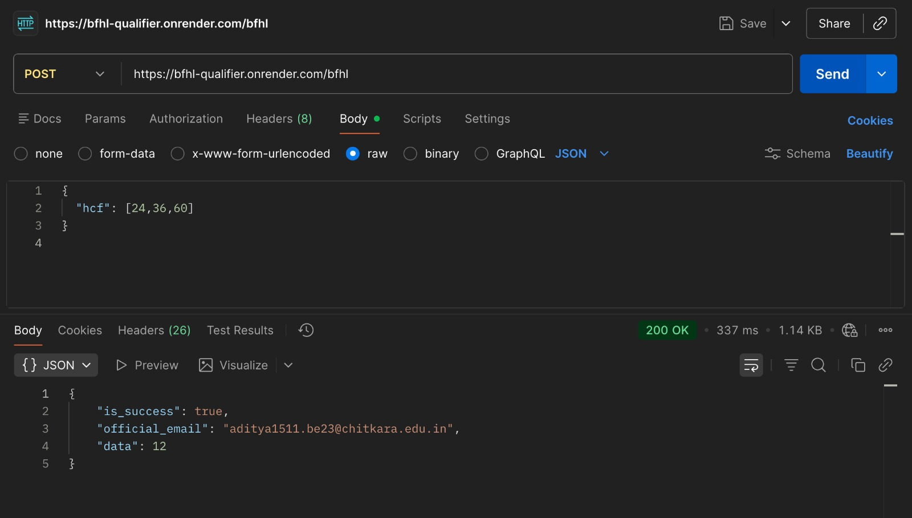
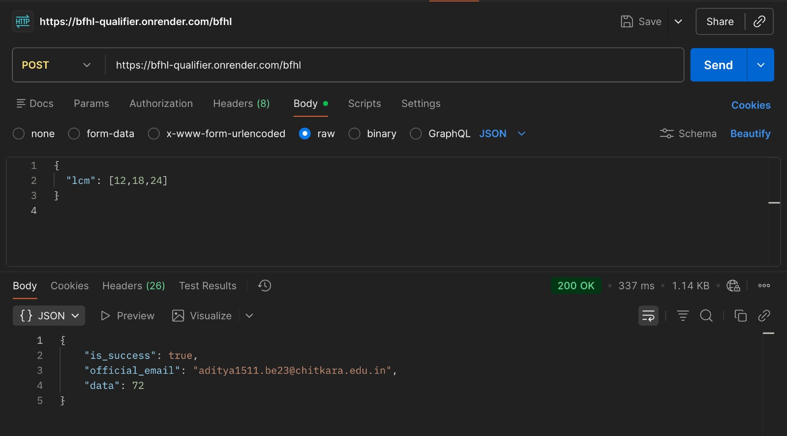
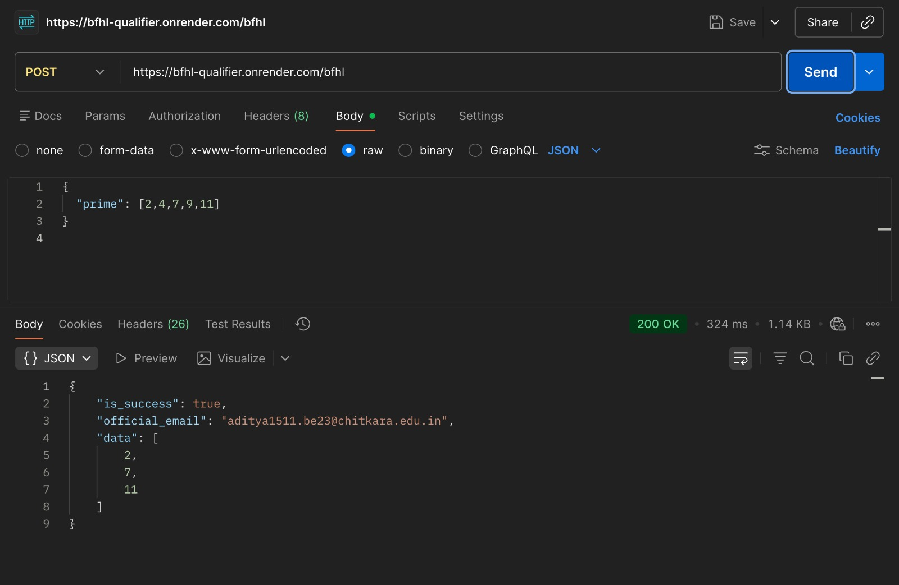
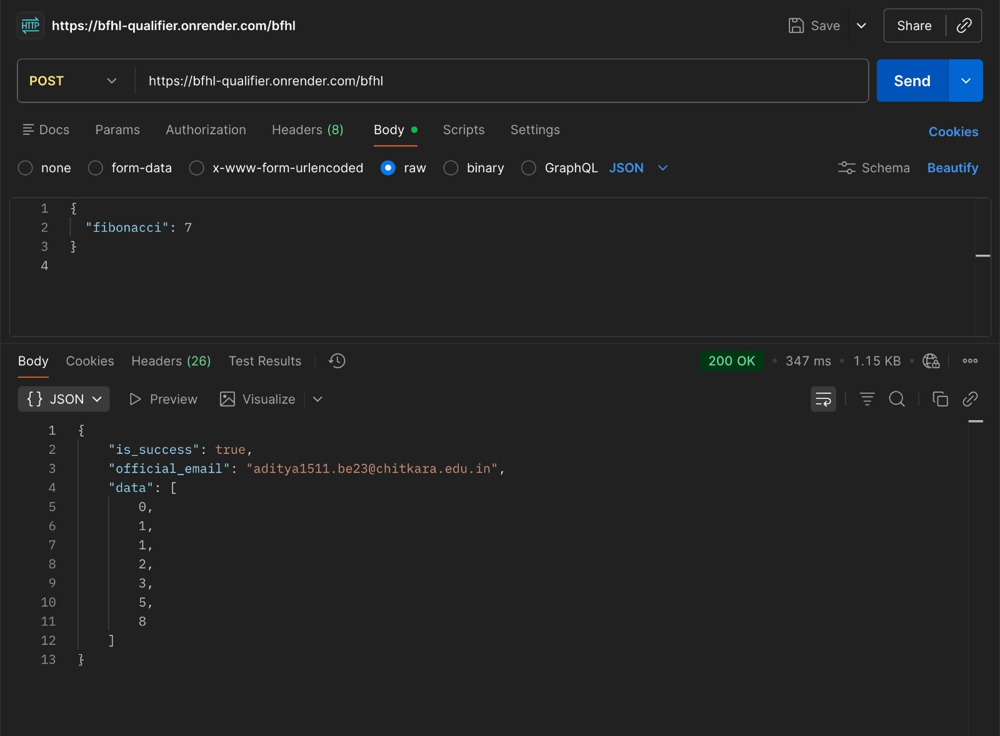

# Qualifier 1 — API (BFHL)

Express API with:
- `POST /bfhl` for **AI**, **HCF**, **LCM**, **PRIME**, **FIBONACCI**
- `GET /health`

## Screenshots

Place your screenshots in a folder named `screenshots/` at the project root, using these filenames:

- `screenshots/post-ai.png`
- `screenshots/post-hcf.png`
- `screenshots/post-lcm.png`
- `screenshots/post-prime.png`
- `screenshots/post-fibonacci.png`
- `screenshots/get-health.png`

## POST - AI

**Endpoint**: `POST /bfhl`  
**Body**:
```json
{ "AI": "your question" }
```


## POST - HCF

**Endpoint**: `POST /bfhl`  
**Body**:
```json
{ "hcf": [12, 18] }
```



## POST - LCM

**Endpoint**: `POST /bfhl`  
**Body**:
```json
{ "lcm": [12, 18] }
```



## POST - PRIME

**Endpoint**: `POST /bfhl`  
**Body**:
```json
{ "prime": [1, 2, 3, 4, 5, 17, 18] }
```



## POST - FIBONACCI

**Endpoint**: `POST /bfhl`  
**Body**:
```json
{ "fibonacci": 7 }
```



## GET

### GET - Health

**Endpoint**: `GET /health`


## Run locally

```bash
npm install
node index.js
```


